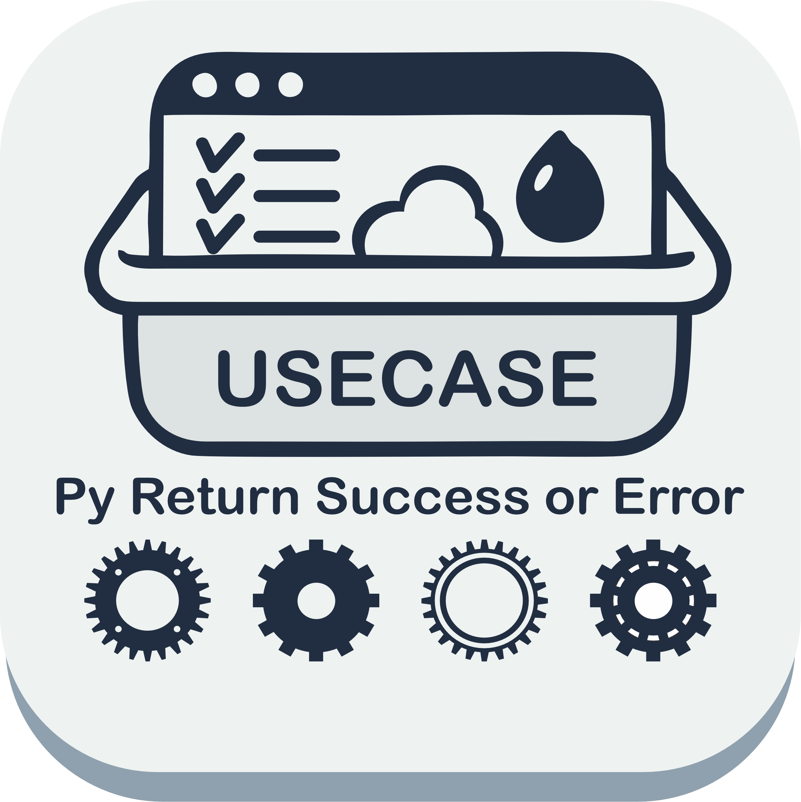

{width="300" .center}

# py-return-success-or-error

Result/Either com **erro fechado por feature** para Clean Architecture em Python: `DataSource → Repository → Usecase`, async-first, tipagem estrita e **zero dependências**.

## A solução por design

Cada feature declara o seu **conjunto fechado de erros** — uma união de tipos concretos — e o resultado é parametrizado nesse conjunto:

```python
type CheckConnectionError = Offline | ConnectionTimeout | ErrorGeneric

result: ReturnSuccessOrError[str, CheckConnectionError]
```

O consumo é **exaustivo**: com `match/case` + `assert_never`, o mypy/pyright prova em tempo de checagem que nenhum caso ficou sem tratamento.

As falhas têm três origens, todas convergindo para a união fechada:

| Origem | Onde é tratada |
|---|---|
| Regra de negócio | `process` → `self.fail(caso)` |
| Falha técnica de I/O | `RepositoryBase.map_error` (abstrato) |
| Bug inesperado | `UsecaseExecutorBase.on_unexpected` (abstrato) |

O **cancelamento** (`asyncio.CancelledError`) nunca vira `Failure` — propaga como exceção.

## Instalação

```bash
pip install py-return-success-or-error
```

Requer Python **>= 3.13**. Para o guia completo (início rápido, fluxo de execução, composição/DI e migração da 0.x), veja o [README no repositório](https://github.com/pwlimaverde/py-return-success-or-error). A referência de API está no menu lateral.
